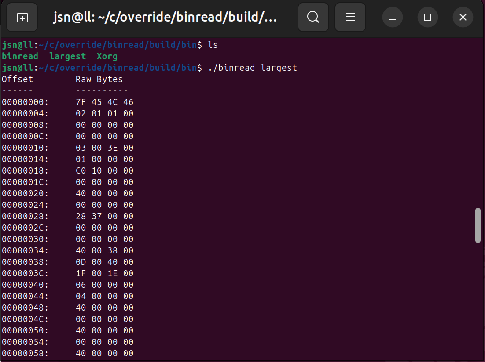
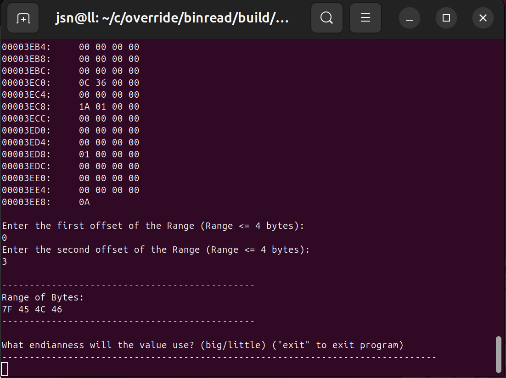
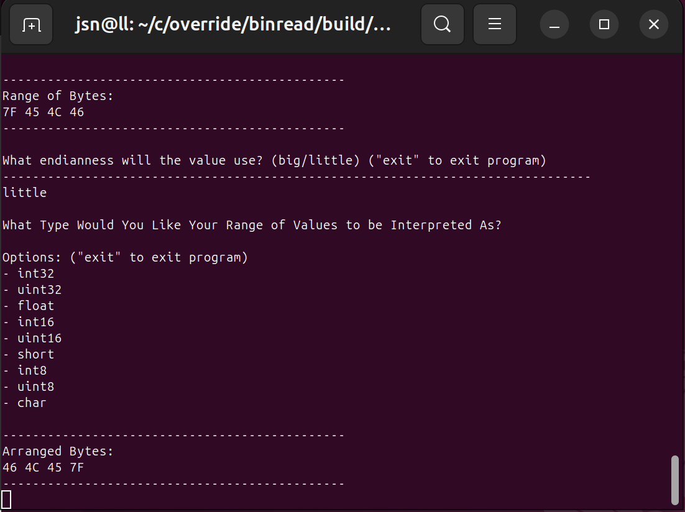
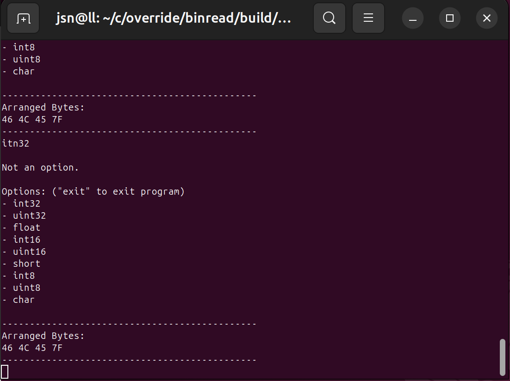
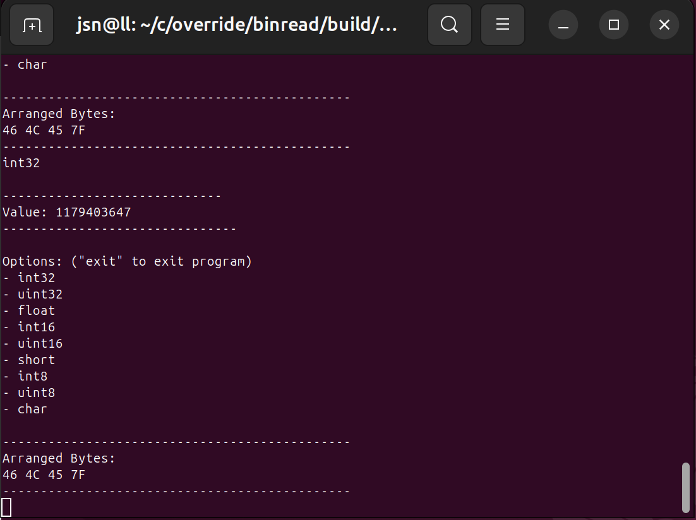
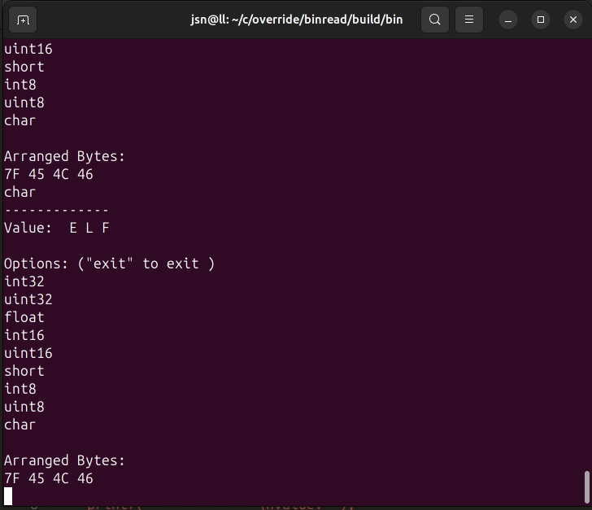
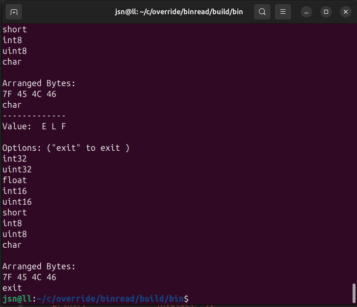

## binread
`binread` is an interactive command-line binary inspection tool written in C. It
loads a binary file into a byte-addressable buffer, displays its contents in
hexadecimal, and allows a selected range of bytes to be interpreted using
different C data types and byte orders.

The project focuses on the boundary between raw object representation and typed
data: selecting bytes by offset, handling endianness explicitly, and examining
the same underlying bit pattern through multiple C representations.

## Current Features

-   Reads binary files up to 1 MB into an internal byte buffer.
-   Displays file contents with hexadecimal offsets and raw bytes.
-   Selects a range of one to four bytes using hexadecimal offsets.
-   Detects the host machine's byte order.
-   Accepts big-endian or little-endian input for multi-byte selections.
-   Rearranges selected bytes for interpretation on the host machine.
-   Interprets data as:
    -   `int32`
    -   `uint32`
    -   `float`
    -   `int16`
    -   `uint16`
    -   `short`
    -   `int8`
    -   `uint8`
    -   `char`
-   Allows repeated interpretations of the same selected memory range.

## Project Structure

``` text
override/
└── binread/
    ├── inc/        Header files
    ├── src/        C source files
    ├── Makefile
    └── build/      Generated build output
```

The implementation is divided into modules responsible for reading a
file, selecting bytes, processing user input, handling byte order, and
interpreting selected memory.

## Building

### Requirements

-   GCC
-   GNU Make
-   A Unix-like development environment

From the `binread` directory:

``` sh
make
```

The Makefile builds the executable at:

``` text
build/bin/binread
```

The current development build uses debug information,
and the warning flags `-Wall`, `-Wextra`, and `-Wshadow`.

To remove generated build files:

``` sh
make clean
```

## Usage

Run `binread` with a binary file as its first argument:

``` sh
./build/bin/binread <file>
```

The program first prints the file as hexadecimal bytes. It then prompts
for two hexadecimal offsets defining a range of no more than four bytes.

For multi-byte selections, the program asks for the byte order of the
selected value:

``` text
big
little
```

It then presents the available C interpretations and allows the same
selected bytes to be viewed as different types until `exit` is entered.

## Example Workflow

``` text
binary file
    |
    v
file byte buffer
    |
    v
```

```text
select offsets
    |
    v
selected raw bytes
    |
    v
````

````text
byte-order handling
    |
    v
host-arranged bytes
    |
    v
````


```text
requested C interpretation
    |
    v
terminal output
```





This separation is intentional: the bytes read from the file are
preserved as raw data until the program has enough information to
determine how the user wants them interpreted.

## Concepts Explored

`binread` is primarily an exercise of systems-C. Its implementation
exercises:

-   Fixed-width integer types from `<stdint.h>`
-   Pointers and byte-level memory access
-   Opaque structure interfaces
-   Unions and multiple views of the same storage
-   Signed and unsigned integer representation
-   Endianness and object representation
-   Bitwise operations
-   Bounds checking
-   Buffered file I/O
-   Input validation
-   Modular C source/header organization
-   Make-based compilation and dependency generation

## Current Status

The project is under active development. The current implementation is
an interactive inspection utility rather than a complete general-purpose
binary parser or hex editor.

Areas still suitable for further development include stronger
command-line and file-error handling, expanded interpretation and
formatting options, additional validation, tests, and support for more
structured binary data.

## Build Configuration

The included Makefile automatically discovers C source files, places
object and dependency files under `build/obj`, and writes the final
executable to `build/bin/binread`.

Dependency files are generated automatically so changes to included
headers can trigger the appropriate recompilation.
